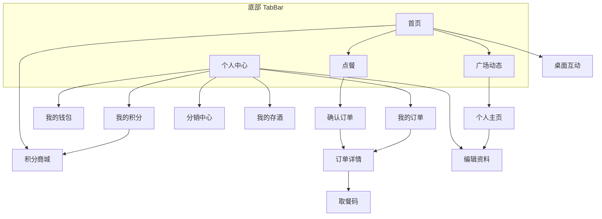

# jiuba 酒吧点餐 — 产品需求文档（PRD）

| 属性 | 值 |
|---|---|
| 项目名称 | jiuba |
| 项目描述 | 酒吧点餐前端（用户端 H5 / 小程序） |
| 文档版本 | v1.0 |
| 数据库 | MySQL，库名 `travel` |
| Scaffold Git | https://github.com/shengqianxiong/agent-repair.git |
| 分支/Ref | `agent` |

---

## 1. 背景与目标

### 1.1 背景

jiuba 是一款面向酒吧/夜店场景的综合生活服务应用，核心能力为**堂食点餐、取餐核销、会员权益、存酒管理、积分商城、社交广场、分销裂变、桌台互动**等。本批次设计稿覆盖**用户端（mobile）16 个页面**，无管理端 UI 稿，管理端接口在本 PRD 中按业务域预留。

### 1.2 产品目标

1. **点餐闭环**：分类浏览 → 加购 → 确认订单 → 支付 → 取餐码核销 → 订单追踪。
2. **会员运营**：积分获取/兑换、钱包充值提现、VIP 会员、分销邀请返利。
3. **社交互动**：广场动态瀑布流、个人主页、私信、桌台入座互动。
4. **存酒服务**：存酒列表、取酒/续存申请。
5. **可离线开发**：uni-app + uView Plus，接口层 + Mock 数据，本地无后端可运行。

### 1.3 技术约束

| 端 | 目录 | 端口 | 技术栈 |
|---|---|---|---|
| 用户端 | `jiuba-app` | 8080 | uni-app + Vue 3 + uview-plus，`/app/**`，H5 port 8080 |

**开发规范（必须遵守）**

1. 基于 UniApp Vue3 组合式 API，技术栈固定 uView Plus 最新版。
2. 搭建标准项目目录，拆分：请求封装、工具方法、接口层、模拟数据。
3. 所有接口预留请求方法，配套 Mock 数据，本地无需后端可运行。
4. 页面间跳转、传参、返回逻辑全部打通，`pages.json` 路由配置完整。
5. UI 严格参照设计稿像素级还原，布局美观适配全端。
6. 代码格式整洁规范，语法严谨无报错，具备二次开发性。
7. 增加加载动画、吐司提示、空状态、表单基础校验。
8. 输出可直接复制运行的完整代码，附带 `pages.json` 路由配置。

---

## 2. 用户角色

| 角色 | 说明 | 使用端 |
|---|---|---|
| 普通用户 | 浏览首页、点餐下单、查看订单、使用钱包/积分 | mobile（`jiuba-app`） |
| 会员用户 | 享受会员价、VIP 特权、积分加速、存酒服务 | mobile |
| 分销用户 | 邀请好友、查看收益、提现至钱包 | mobile |
| 社交用户 | 发布/浏览广场动态、私信、查看他人主页 | mobile |
| 桌台用户 | 扫码入座、参与桌面互动 | mobile |
| 门店管理员 | 商品/订单/存酒/用户管理（本批无 UI 稿，接口预留） | admin（后续迭代） |
| 平台运营 | 活动、积分商品、分销配置（本批无 UI 稿，接口预留） | admin（后续迭代） |

---

## 3. 功能清单

### 3.1 用户端（mobile）— 本批实现范围

| 模块 | 功能点 | 对应页面 |
|---|---|---|
| 首页 | 欢迎卡、快捷入口、六宫格服务、精选活动横滑、FAB | `home` |
| 点餐 | 分类侧边栏、商品列表、购物车浮动条、加购 | `menu` |
| 订单 | 确认订单、订单列表（多状态）、订单详情、取餐码、再来一单 | `confirmOrder`、`myOrders`、`orderDetail` |
| 个人中心 | 用户信息、会员横幅、三栏入口、积分进度、功能菜单、TabBar | `profile` |
| 编辑资料 | 头像/昵称/性别/年龄/电话/简介/相册/微信码 | `editProfile` |
| 钱包 | 余额概览、提现/充值、资金明细/提现记录/提现账号 | `wallet` |
| 积分 | 积分概览、明细流水、跳转积分商城 | `points` |
| 积分商城 | 余额卡、分类 Tab、商品网格、签到赚积分 | `pointsMall` |
| 分销 | 累计收益、邀请统计、邀请横幅、邀请榜单 | `distribution` |
| 存酒 | 搜索、列表、取酒/续存 | `storedWine` |
| 广场 | 快捷筛选、分类 Tab、瀑布流 Feed、发帖 FAB | `squareFeed` |
| 社交主页 | 用户卡片、动态瀑布流、私信 | `userProfile` |
| 桌台互动 | 桌台状态、8 座位布局、入座/离座 | `tableInteraction` |

### 3.2 管理端（admin）— 本批无设计稿，接口预留

> **说明**：识图 JSON 注明「本批 16 张设计稿均为用户端页面，未包含管理端设计稿」。以下功能仅作接口与数据模型预留，UI 不在本迭代范围。

| 模块 | 预留能力 |
|---|---|
| 登录鉴权 | 管理员账号密码登录，返回 token（禁止 RBAC/菜单权限） |
| 商品管理 | 分类、商品 CRUD、上下架 |
| 订单管理 | 订单列表、状态流转、取餐核销 |
| 存酒管理 | 存酒记录审核、取酒/续存处理 |
| 用户管理 | 用户列表、会员等级 |
| 活动/积分 | 活动配置、积分商品管理 |
| 分销配置 | 佣金规则、邀请记录 |
| 桌台管理 | 桌台/座位配置 |

---

## 4. 鉴权与登录约定

| 规则 | 说明 |
|---|---|
| 鉴权 Header | 全站 API 使用 Header `token` 鉴权（**登录/注册接口除外**） |
| 用户端登录 | `POST /sqx_fast/app/**/login`，仅校验账号密码并返回 token |
| 管理端登录 | `POST /sqx_fast/admin/**/login`，与用户端**必须分开** |
| 禁止项 | 登录/注册接口**禁止**接入菜单权限、Shiro `@RequiresPermissions`、RBAC |

### 4.1 用户端登录流程

```
打开应用 → POST /sqx_fast/app/user/login → 存储 token → 跳转首页
```

---

## 5. Design Tokens（完整保留，前端 1:1 还原）

> 以下 tokens 来自识图 JSON，**禁止擅自修改色值、字号、圆角、阴影**；uni-app 中通过 CSS 变量或 `uni.scss` 统一注入。

### 5.1 Colors

| Token | 值 |
|---|---|
| `primary` | `#7B61FF` |
| `primaryDark` | `#6B35FF` |
| `primaryLight` | `#EBE4FF` |
| `primaryGradient` | `linear-gradient(135deg, #7246F2 0%, #9D7BFF 100%)` |
| `secondary` | `#A286FF` |
| `background` | `#F8F9FB` |
| `backgroundAlt` | `#F8F8FA` |
| `cardBg` | `#FFFFFF` |
| `surface` | `#F1EEFF` |
| `inputBg` | `#F7F7F7` |
| `textPrimary` | `#333333` |
| `textMain` | `#1A1A1A` |
| `textSecondary` | `#666666` |
| `textTertiary` | `#999999` |
| `textLight` | `#CCCCCC` |
| `textOnPrimary` | `#FFFFFF` |
| `border` | `#EEEEEE` |
| `divider` | `#F0F0F0` |
| `danger` | `#FF4D4F` |
| `success` | `#52C41A` |
| `successAlt` | `#00C08B` |
| `warning` | `#FAAD14` |
| `memberPriceBg` | `#FFE4E1` |
| `memberPriceText` | `#E64340` |
| `tagBg` | `#F5F5F5` |
| `genderFemale` | `#FF69B4` |
| `iconBgPurple` | `#F0EDFF` |
| `iconBgPink` | `#FFEDED` |
| `bannerBg` | `#F2F1F0` |
| `badgeRed` | `#FF4D4F` |

### 5.2 Typography

| 属性 | 值 |
|---|---|
| `fontFamily` | `PingFang SC, -apple-system, sans-serif` |

**fontSize**

| Token | 值 |
|---|---|
| `xs` | `12px` |
| `sm` | `14px` |
| `base` | `16px` |
| `lg` | `18px` |
| `xl` | `20px` |
| `xxl` | `24px` |
| `huge` | `28px` |
| `display` | `48px` |

**fontWeight**

| Token | 值 |
|---|---|
| `regular` | `400` |
| `medium` | `500` |
| `semibold` | `600` |
| `bold` | `700` |

**lineHeight**

| Token | 值 |
|---|---|
| `tight` | `1.2` |
| `normal` | `1.5` |
| `relaxed` | `1.8` |

### 5.3 Spacing

| Token | 值 |
|---|---|
| `xs` | `4px` |
| `sm` | `8px` |
| `md` | `12px` |
| `base` | `16px` |
| `lg` | `20px` |
| `xl` | `24px` |
| `xxl` | `32px` |
| `pagePadding` | `16px` |
| `cardPadding` | `20px` |
| `cardGap` | `12px` |
| `sectionGap` | `24px` |

### 5.4 Radius

| Token | 值 |
|---|---|
| `xs` | `4px` |
| `sm` | `8px` |
| `md` | `12px` |
| `lg` | `16px` |
| `xl` | `20px` |
| `xxl` | `24px` |
| `card` | `24px` |
| `button` | `24px` |
| `pill` | `100px` |
| `full` | `9999px` |
| `image` | `16px` |
| `tag` | `10px` |

### 5.5 Shadows

| Token | 值 |
|---|---|
| `card` | `0 4px 16px rgba(0, 0, 0, 0.04)` |
| `cardPurple` | `0 4px 16px rgba(123, 97, 255, 0.08)` |
| `button` | `0 4px 12px rgba(123, 97, 255, 0.25)` |
| `floatBar` | `0 8px 24px rgba(0, 0, 0, 0.08)` |
| `bottomBar` | `0 -4px 15px rgba(0, 0, 0, 0.08)` |
| `fab` | `0 4px 15px rgba(123, 97, 255, 0.3)` |

### 5.6 TabBar 配置

| 属性 | 值 |
|---|---|
| `activeColor` | `#7B61FF` |
| `inactiveColor` | `#999999` |

| 序号 | text | pagePath | icon |
|---|---|---|---|
| 1 | 首页 | `/pages/home/index` | `home` |
| 2 | 点餐 | `/pages/menu/index` | `order` |
| 3 | 排行榜 | `/pages/square/index` | `rank` |
| 4 | 我的 | `/pages/my/index` | `user` |

---

## 6. 页面说明

### 6.1 页面归属总览

| 端 | 目录 | 本批页面数 | 说明 |
|---|---|---|---|
| mobile 用户端 | `jiuba-app` | 16（15 独立路由 + 1 重复稿） | 本批全部实现 |
| admin 管理端 | — | 0 | 无设计稿，仅接口预留 |

### 6.2 路由与 pages.json 规划

```json
{
  "pages": [
    { "path": "pages/home/index", "style": { "navigationStyle": "custom" } },
    { "path": "pages/menu/index", "style": { "navigationStyle": "custom" } },
    { "path": "pages/square/index", "style": { "navigationStyle": "custom" } },
    { "path": "pages/my/index", "style": { "navigationStyle": "custom" } },
    { "path": "pages/order/confirm", "style": { "navigationStyle": "custom" } },
    { "path": "pages/order/list", "style": { "navigationStyle": "custom" } },
    { "path": "pages/order/detail", "style": { "navigationStyle": "custom" } },
    { "path": "pages/wallet/index", "style": { "navigationStyle": "custom" } },
    { "path": "pages/points/index", "style": { "navigationStyle": "custom" } },
    { "path": "pages/points/mall", "style": { "navigationStyle": "custom" } },
    { "path": "pages/distribution/index", "style": { "navigationStyle": "custom" } },
    { "path": "pages/wine/stored", "style": { "navigationStyle": "custom" } },
    { "path": "pages/social/profile", "style": { "navigationStyle": "custom" } },
    { "path": "pages/profile/edit", "style": { "navigationStyle": "custom" } },
    { "path": "pages/table/interaction", "style": { "navigationStyle": "custom" } }
  ],
  "tabBar": {
    "color": "#999999",
    "selectedColor": "#7B61FF",
    "list": [
      { "pagePath": "pages/home/index", "text": "首页", "iconPath": "static/tab/home.png", "selectedIconPath": "static/tab/home-active.png" },
      { "pagePath": "pages/menu/index", "text": "点餐", "iconPath": "static/tab/order.png", "selectedIconPath": "static/tab/order-active.png" },
      { "pagePath": "pages/square/index", "text": "排行榜", "iconPath": "static/tab/rank.png", "selectedIconPath": "static/tab/rank-active.png" },
      { "pagePath": "pages/my/index", "text": "我的", "iconPath": "static/tab/user.png", "selectedIconPath": "static/tab/user-active.png" }
    ]
  }
}
```

> **uView Plus 组件建议**：自定义导航栏使用 `u-navbar` 或完全自定义 view；按钮使用 `u-button`（`shape="circle"` / 自定义 `customStyle`）；输入框 `u-input`；搜索 `u-search`；Tab `u-tabs`；Switch `u-switch`；Toast `u-toast`；Loading `u-loading-page` / `u-loading-icon`；空状态 `u-empty`；瀑布流可自研双列或 `u-waterfall`（若版本支持）。

---

### 6.3 Mobile 页面详情

---

#### 6.3.1 home — 首页

| 属性 | 值 |
|---|---|
| 标题 | 首页 |
| 路径 | `/pages/home/index` |
| 类型 | mobile |
| imageIndex | 9 |

**Layout**

顶部导航 + 紫色渐变欢迎卡片 + 双主操作卡片 + 六宫格服务入口 + 精选活动横滑列表 + 右下角 FAB + 底部 TabBar。

**Components**

| 组件名 | 描述 | 样式 |
|---|---|---|
| `Navbar` | 汉堡菜单、居中「云享生活」、带红点通知铃铛 | 紫色 18px 加粗 |
| `HeroCard` | WELCOME BACK、开启今日云享之旅、LV.5 高级会员徽章、在线预约中/1240 积分状态 | 紫色渐变背景圆角 24px，白色文字 |
| `MainActionCards` | 自助点餐（紫色底）与在线预约（白底紫字）双卡片 | 并排 gap 12px，高度 120px |
| `ServiceGrid` | 酒水套餐/附近搭子/会员中心/我的积分/团购/互动游戏六宫格 | 背景 `#F8F9FB` 圆角 24px |
| `FeaturedActivities` | 「精选活动」标题 + 查看全部，横滑活动卡片 | margin-top 24px |
| `ActivityCard` | 鸡尾酒图 + 限时优惠标签 + 套餐名 + 价格 ¥298/¥588 +「立即抢购」 | 圆角 20px 带阴影 |
| `FAB` | 右下角紫色圆形 + 号悬浮按钮 | 56px 直径 |
| `TabBar` | 首页(激活)/点餐/排行榜/我的 | 白色背景顶部边框 |

**Navigation**

| 方向 | 目标 |
|---|---|
| from | `tabBar` |
| to | `menu`、`booking`、`pointsMall`、`squareFeed`、`activityDetail` |

**uView 映射建议**：`u-grid`（六宫格）、`u-scroll-list` 或 `scroll-view`（活动横滑）、`u-badge`（通知红点）、固定定位 FAB 按钮。

---

#### 6.3.2 menu — 点餐

| 属性 | 值 |
|---|---|
| 标题 | 点餐 |
| 路径 | `/pages/menu/index` |
| 类型 | mobile |
| imageIndex | 8 |

**Layout**

顶部导航 + 左侧分类侧边栏(100px) + 右侧商品列表 + 底部浮动结算栏 + 底部 TabBar。

**Components**

| 组件名 | 描述 | 样式 |
|---|---|---|
| `TopNavigationBar` | 汉堡菜单、居中「云享生活」、搜索与通知图标 | 白色背景，高度 44px |
| `CategorySidebar` | 精酿/梦幻德州/精致小吃/经典啤酒/清爽软饮/特调鸡尾分类，激活项紫色竖线指示 | 宽 100px，背景 `#F8F8F8` |
| `ProductSectionHeader` | 当前分类标题「精酿啤酒系列」+ 描述副标题 | margin 15px，加粗 |
| `ProductCard` | 商品缩略图、名称、描述、价格 ¥38、会员价标签、紫色 + 号按钮 | 白色卡片圆角 16px，会员价浅粉底标签 |
| `FloatingCheckoutBar` | 购物车图标 + 红色角标 2、总价 ¥80.00、预估优惠、「去结算」紫色按钮 | 白色圆角 30px 浮动条，阴影 |
| `BottomTabBar` | 首页/点餐(激活)/排行榜/我的 | 高度 50px |

**Navigation**

| 方向 | 目标 |
|---|---|
| from | `home`、`tabBar` |
| to | `confirmOrder`、`productDetail`、`cart` |

**uView 映射建议**：左右分栏 `flex` 布局；分类激活态左边框或 `u-line`；`u-number-box` 或自定义 + 按钮；底部栏 `position: fixed` + `shadow floatBar`。

---

#### 6.3.3 confirmOrder — 确认订单

| 属性 | 值 |
|---|---|
| 标题 | 确认订单 |
| 路径 | `/pages/order/confirm` |
| 类型 | mobile |
| imageIndex | 10 |

**Layout**

顶部导航 + 门店信息卡 + 商品清单卡 + 支付方式卡 + 订单备注卡 + 底部提交栏（隐含）。

**Components**

| 组件名 | 描述 | 样式 |
|---|---|---|
| `NavBar` | 返回箭头、居中「确认订单」 | 紫色标题 |
| `StoreInfoCard` | 门店名称地址、堂食标签、虚线分割、当前座位 A-08 桌 | 白色卡片圆角 16px，座位号紫色加粗 |
| `ProductListCard` | 商品清单列表（图+名+规格+数量+单价）、商品小计、打包费、合计紫色大字 | 白色卡片 |
| `PaymentMethodCard` | 微信支付(选中紫色勾)、零钱支付(未选中圆圈) | 每项含图标名称提示 |
| `RemarksCard` | 订单备注入口，编辑图标 +「无备注」+ 箭头 | 可点击跳转备注编辑 |

**Navigation**

| 方向 | 目标 |
|---|---|
| from | `menu` |
| to | `orderDetail`、`remarkEdit`、`payment` |

**uView 映射建议**：`u-radio-group` / 自定义单选；`u-cell` 备注行；底部固定 `u-button` 提交订单。

---

#### 6.3.4 orderDetail — 订单详情

| 属性 | 值 |
|---|---|
| 标题 | 订单详情 |
| 路径 | `/pages/order/detail` |
| 类型 | mobile |
| imageIndex | 1 / 11（两稿视觉一致，合并实现） |

**Layout**

纵向滚动布局，浅灰背景上叠放多个白色圆角卡片，底部固定操作栏。顶部自定义导航栏，状态区居中展示，取餐号大卡片突出显示，商品清单与订单信息依次排列。

**Components**

| 组件名 | 描述 | 样式 |
|---|---|---|
| `CustomNavBar` / `NavigationBar` | 左侧返回箭头、居中标题「订单详情」、右侧分享图标 | 背景透明，高度 44px，紫色文字与图标 |
| `StatusSection` / `StatusHeader` | 订单状态徽章「等待出餐中」+ 预计时间文案 | 居中布局，徽章浅紫底 `#F0E9FF`，紫色文字 |
| `PickupCard` | 取餐号 A086 大号展示，待制作/制作中统计，「向店员展示取餐码」主按钮 | 白色大卡片圆角 24px，取餐号 48px 紫色加粗，按钮紫色胶囊带阴影 |
| `OrderItemsCard` | 门店信息、商品列表、费用明细、合计金额 | 白色卡片，优惠红色，合计紫色大号字体 |
| `OrderInfoCard` | 订单编号、下单时间、支付方式（微信图标）、备注信息 | 键值对行布局，灰色标签深色值 |
| `FooterLinks` | 联系门店、售后帮助两个链接，中间竖线分隔 | 居中水平排列，图标+文字 |
| `BottomActionBar` | 实付金额展示、「再来一单」描边按钮、「订单详情卡」实心按钮 | 白色背景顶部阴影，flex 横向布局 |

**Navigation**

| 方向 | 目标 |
|---|---|
| from | `myOrders`、`confirmOrder` |
| to | `pickupCode`、`reorder`、`contactStore` |

---

#### 6.3.5 myOrders — 我的订单

| 属性 | 值 |
|---|---|
| 标题 | 我的订单 |
| 路径 | `/pages/order/list` |
| 类型 | mobile |
| imageIndex | 15 |

**Layout**

顶部导航 + 横向状态 Tab + 滚动订单卡片列表 + 底部 TabBar。含制作中紫色高亮卡、待出餐/已完成/已取消白卡。

**Components**

| 组件名 | 描述 | 样式 |
|---|---|---|
| `Header` | 汉堡菜单、居中「我的订单」紫色、通知铃铛 | 顶部固定 |
| `StatusTabs` | 全部/制作中/待出餐/已完成/已取消横滑 Tab | 全部激活紫色圆点指示 |
| `ActiveOrderCard` | 紫色背景制作中卡片：状态标签 + 前面还有 3 位 + 点餐号码 A108 + 嵌套商品白卡 | 紫色实心背景圆角 16px |
| `PendingOrderCard` | 待出餐白卡：日期 + 商品信息 + 查看详情/取餐码按钮 | 白色卡片浅阴影 |
| `CompletedOrderCard` | 已完成白卡：商品图 + 名称 + 门店 + 价格 + 再来一单/评价赢积分 | 底部双按钮 |
| `CancelledOrderCard` | 已取消虚线边框卡：灰色图标 + 退款说明 + 灰色价格 | 虚线边框 |
| `BottomTabBar` | 首页/点餐/我的(激活)/设置 | 紫色激活态 |

**Navigation**

| 方向 | 目标 |
|---|---|
| from | `profile` |
| to | `orderDetail`、`pickupCode`、`reorder`、`review` |

**uView 映射建议**：`u-tabs` 横滑；`u-list` + 下拉刷新；不同状态卡片用 `v-if` 切换模板。

---

#### 6.3.6 profile — 个人中心

| 属性 | 值 |
|---|---|
| 标题 | 个人中心 |
| 路径 | `/pages/my/index` |
| 类型 | mobile |
| imageIndex | 7 |

**Layout**

顶部导航 + 用户信息区 + 紫色渐变会员横幅 + 三栏功能入口 + 积分进度卡片 + 功能菜单列表 + 版本信息 + 底部 TabBar。

**Components**

| 组件名 | 描述 | 样式 |
|---|---|---|
| `Header` | 左侧菜单、居中「云享生活」、右侧通知铃铛 | 背景 `#F8F9FB`，紫色加粗标题 |
| `UserProfile` | 圆形头像带 LV.5 等级标签、昵称「高级会员」、ID、右侧设置齿轮 | flex 横向居中，padding 20px |
| `VIPBanner` | 紫色渐变会员卡片 +「立即开通」白色按钮 | 圆角 16px，margin 16px |
| `StatCards` | 账户余额、快速取酒、订单中心三栏入口 | grid 三列，gap 12px |
| `PointsCard` | 我的积分 12450、紫色进度条、升级提示、「去赚积分」链接 | 白色卡片圆角 16px |
| `MenuList` | 邀请好友、在线客服、帮助中心、隐私与安全 | 白色卡片，彩色图标 + 箭头 |
| `FooterInfo` | 品牌标识 + Version 3.4.0 | 居中灰色文字 |
| `TabBar` | 首页/点餐/排行榜/我的（激活态） | 顶部 1px `#EEE` 边框 |

**Navigation**

| 方向 | 目标 |
|---|---|
| from | `tabBar` |
| to | `home`、`menu`、`squareFeed`、`wallet`、`points`、`distribution`、`storedWine`、`settings`、`vip` |

**uView 映射建议**：`u-line-progress` 积分进度；`u-cell-group` 菜单列表；`u-avatar` 头像。

---

#### 6.3.7 editProfile — 编辑资料

| 属性 | 值 |
|---|---|
| 标题 | 编辑资料 |
| 路径 | `/pages/profile/edit` |
| 类型 | mobile |
| imageIndex | 12 |

**Layout**

顶部导航 + 居中头像上传 + 表单项纵向排列 + 底部固定保存按钮。

**Components**

| 组件名 | 描述 | 样式 |
|---|---|---|
| `NavBar` | 返回、居中「编辑资料」、右侧更多 | 白色背景紫色标题 18px |
| `AvatarUpload` | 大圆形头像 + 右下角紫色相机图标 +「点击更换头像」 | 直径约 100px |
| `NicknameField` | 昵称标签 + 圆角输入框 | 背景 `#F7F7F7` 圆角 12px |
| `GenderSelector` | 男/女并排选择按钮 | 选中紫色底白字，未选中浅灰底 |
| `AgeAndPhoneRow` | 年龄选择器 + 联系电话输入框并排 | 等宽 gap 12px |
| `NearbyFriendsCard` | 附近好友展示开关 | 白色卡片 + 紫色 Switch |
| `BioTextArea` | 个人简介多行输入 | 高度 120px 灰色背景 |
| `ImageUploadRow` | 个人相册展示 + 微信二维码上传框 | 虚线边框上传区域 |
| `SubmitButton` | 「保存修改」紫色大按钮 | 底部固定 `#7F66FF` 圆角 15px 带阴影 |

**Navigation**

| 方向 | 目标 |
|---|---|
| from | `profile`、`userProfile` |
| to | `profile` |

**uView 映射建议**：`u-upload` 头像/相册；`u-textarea` 简介；`u-switch` 附近好友；`u-picker` 年龄；表单校验 `u-form` + `u-form-item`。

---

#### 6.3.8 wallet — 我的钱包

| 属性 | 值 |
|---|---|
| 标题 | 我的钱包 |
| 路径 | `/pages/wallet/index` |
| 类型 | mobile |
| imageIndex | 4 |

**Layout**

顶部导航 + 资产概览大卡片 + 功能菜单列表卡片 + 底部会员推广横幅。

**Components**

| 组件名 | 描述 | 样式 |
|---|---|---|
| `NavBar` | 返回箭头、居中「我的钱包」紫色标题、右侧铃铛 | 标题 18px 加粗紫色 |
| `AssetCard` | 「我的资产(元)」标签 + 眼睛图标、余额 ¥2,850.45、提现/充值双按钮 | 白色卡片圆角 24px 居中，提现紫色实心，充值浅紫底 |
| `MenuListCard` | 资金明细、提现记录、提现账号三个菜单项 | 白色卡片，左侧紫色圆形图标背景，右侧箭头 |
| `MemberBanner` | 「尊享会员特权」推广横幅 +「去开启」按钮 | 背景 `#F2F1F0`，圆角 20px，按钮紫色胶囊 |

**Navigation**

| 方向 | 目标 |
|---|---|
| from | `profile` |
| to | `fundDetail`、`withdrawRecord`、`withdrawAccount`、`withdraw`、`recharge` |

---

#### 6.3.9 points — 我的积分

| 属性 | 值 |
|---|---|
| 标题 | 我的积分 |
| 路径 | `/pages/points/index` |
| 类型 | mobile |
| imageIndex | 5 |

**Layout**

顶部导航 + 积分概览卡片（含 3D 机器人插图）+ 积分明细列表标题 + 滚动流水列表。

**Components**

| 组件名 | 描述 | 样式 |
|---|---|---|
| `NavigationBar` | 返回箭头、居中「我的积分」、右侧铃铛 | 紫色图标文字，高度 44px |
| `PointsSummaryCard` | 「当前可用积分」标签、2850 分大号数值、右侧 3D 紫色机器人、底部「积分商城」按钮 | 白色大卡片圆角 24px，数值 32px 紫色加粗，按钮紫色全宽 |
| `ListHeader` | 「积分明细」标题 + 筛选漏斗 | 标题黑色加粗，筛选灰色 |
| `TransactionList` | 积分变动记录列表，每项含圆形图标、业务名称、时间戳、紫色变动值 | 白色小卡片圆角，图标背景紫/粉色 |

**Navigation**

| 方向 | 目标 |
|---|---|
| from | `profile` |
| to | `pointsMall`、`pointsFilter` |

---

#### 6.3.10 pointsMall — 积分商城

| 属性 | 值 |
|---|---|
| 标题 | 积分商城 |
| 路径 | `/pages/points/mall` |
| 类型 | mobile |
| imageIndex | 14 |

**Layout**

顶部导航 + 紫色渐变积分余额卡 + 分类 Tab 横滑 + 热门兑换双列商品网格 + 赚积分横幅 + 底部 TabBar。

**Components**

| 组件名 | 描述 | 样式 |
|---|---|---|
| `CustomNavbar` | 返回、居中「积分商城」、右侧历史记录图标 | 高度 88rpx |
| `PointsBalanceCard` | 当前可用积分 1320、积分明细链接、我的兑换按钮 | 紫色渐变圆角 32rpx |
| `CategoryTabs` | 全部商品/数码周边/虚拟礼包/生活 | 横滑胶囊，激活白底紫字 |
| `SectionHeader` | 热门兑换 + 筛选按钮 | 左右分布 |
| `ProductGrid` | 双列商品卡片网格 | gap 20rpx |
| `ProductCard` | 商品图 + HOT/LIMITED 标签 + 名称 + 积分 +「立即兑换」按钮 | 白色圆角 24rpx |
| `EarnPointsBanner` | 赚取更多积分 + 每日签到提示 +「去签到」按钮 | 灰色背景圆角 32rpx |
| `BottomTabBar` | 四栏底部导航 | 固定底部 |

**Navigation**

| 方向 | 目标 |
|---|---|
| from | `points`、`home` |
| to | `pointsHistory`、`redemptionHistory`、`checkin`、`productDetail` |

---

#### 6.3.11 distribution — 分销中心

| 属性 | 值 |
|---|---|
| 标题 | 分销中心 |
| 路径 | `/pages/distribution/index` |
| 类型 | mobile |
| imageIndex | 6 |

**Layout**

顶部导航 + 累计收益大卡 + 双栏统计卡 + 紫色邀请横幅 + 邀请榜单 Tab 列表。

**Components**

| 组件名 | 描述 | 样式 |
|---|---|---|
| `Navbar` | 返回箭头、居中「分销中心」、右侧帮助图标 | 背景透明，高度 44px |
| `TotalEarningsCard` | 累计收益 ¥12,850.42、「提现至钱包>」按钮 | 白色卡片，金额 28px 紫色加粗，提现按钮浅紫底 |
| `StatsGrid` | 邀请人数 142、待入账收益 ¥420.00 两栏卡片 | 等宽并排，图标圆形背景 |
| `PromotionBanner` | 「邀请好友，乐享佣金」紫色全宽横幅 +「立即邀请好友」白色按钮 | 背景 `#9C7CFE`，圆角 20px，白色文字 |
| `LeaderboardSection` | 邀请榜单标题 + 查看全部，Tab「近期活跃/收益贡献」，用户列表 + 加载更多 | 用户行含头像昵称日期贡献金额 |

**Navigation**

| 方向 | 目标 |
|---|---|
| from | `profile` |
| to | `withdraw`、`inviteShare`、`inviteList` |

---

#### 6.3.12 storedWine — 我的存酒

| 属性 | 值 |
|---|---|
| 标题 | 我的存酒 |
| 路径 | `/pages/wine/stored` |
| 类型 | mobile |
| imageIndex | 2 |

**Layout**

顶部导航 + 搜索框 + 列表标题行 + 垂直卡片流。每张存酒卡片上部为酒水实物图，下部白色信息区含名称、分类、存入时间与操作按钮。

**Components**

| 组件名 | 描述 | 样式 |
|---|---|---|
| `AppNavBar` | 左侧菜单图标、居中「云享生活」紫色标题、右侧通知铃铛 | 背景白色，标题 18px 加粗紫色 |
| `SearchBar` | 圆角搜索框，左侧放大镜，占位符「搜索我的存酒...」 | 背景 `#F5F5F5`，圆角 20px，全宽 |
| `ListHeader` | 「我的存酒 (3)」标题 + 右侧筛选漏斗图标 | 左右分布，标题 16px 加粗 |
| `StoredWineCard` | 酒水图片 + 剩余瓶数紫色胶囊标签、商品名、分类、存入日期、取酒/续存按钮 | 圆角 15px 白色卡片浅阴影，主按钮紫色全宽，续存按钮浅紫底 |
| `BottomTabBar` | 首页/点餐/排行榜/我的四栏底部导航 | 白色背景，激活态紫色带点指示 |

**Navigation**

| 方向 | 目标 |
|---|---|
| from | `profile` |
| to | `retrieveWine`、`renewWine` |

**uView 映射建议**：`u-search`；卡片内 `u-button` 双按钮布局。

---

#### 6.3.13 squareFeed — 广场动态

| 属性 | 值 |
|---|---|
| 标题 | 广场动态 |
| 路径 | `/pages/square/index` |
| 类型 | mobile |
| imageIndex | 13 |

**Layout**

顶部导航 + 快捷筛选按钮组 + 分类 Tab + 两列瀑布流 Feed + 右下角 FAB + 底部 TabBar。

**Components**

| 组件名 | 描述 | 样式 |
|---|---|---|
| `NavBar` | 汉堡菜单、居中「广场动态」、带红点铃铛 | 白色背景紫色元素 |
| `QuickFilterButtons` | 附近搭子/今日热门/约个饭三个胶囊按钮 | 激活紫色底白字，未选中浅灰底 |
| `CategoryTabs` | 推荐/附近/最新三个 Tab | 推荐激活紫色加粗下划线 |
| `MasonryFeed` | 两列不等高动态卡片：图片/拼图、标题、头像昵称、点赞数、年龄距离标签 | 卡片圆角 20px，标签浅紫胶囊 |
| `CreateFAB` | 右下角紫色渐变圆形 + 号按钮 | 带紫色阴影 |
| `BottomTabBar` | 首页/点餐/排行榜(激活)/我的 | 固定底部 |

**Navigation**

| 方向 | 目标 |
|---|---|
| from | `tabBar`、`home` |
| to | `userProfile`、`postDetail`、`createPost` |

---

#### 6.3.14 userProfile — 个人主页

| 属性 | 值 |
|---|---|
| 标题 | 个人主页 |
| 路径 | `/pages/social/profile` |
| 类型 | mobile |
| imageIndex | 3 |

**Layout**

顶部导航 + 悬浮式用户信息卡片 + 动态区块标题 + 两列瀑布流动态图片网格。

**Components**

| 组件名 | 描述 | 样式 |
|---|---|---|
| `CustomNavBar` | 返回箭头、居中「个人主页」、右侧更多操作 | 背景透明或极淡粉 |
| `ProfileCard` | 圆形头像、右上角「私信 TA」紫色按钮、昵称、性别年龄标签、地理位置、个性签名 | 白色圆角 24px 卡片带阴影，性别标签粉色图标 |
| `SectionHeader` | 「TA 的动态」标题 +「共 18 篇」统计 | 左右分布 |
| `DynamicGrid` | 两列瀑布流图片列表，部分带底部文字遮罩 | 图片大圆角 16px，不等高瀑布流 |

**Navigation**

| 方向 | 目标 |
|---|---|
| from | `squareFeed` |
| to | `dynamicDetail`、`chat` |

---

#### 6.3.15 tableInteraction — 桌面互动

| 属性 | 值 |
|---|---|
| 标题 | 桌面互动 |
| 路径 | `/pages/table/interaction` |
| 类型 | mobile |
| imageIndex | 16 |

**Layout**

顶部导航 + 桌台标题区 + 双栏统计卡 + 中央圆形座位布局(8 座位环绕) + 底部浮动用户状态卡 + 底部 TabBar。

**Components**

| 组件名 | 描述 | 样式 |
|---|---|---|
| `Navbar` | 汉堡菜单、居中「桌面互动」、通知铃铛 | 透明背景紫色元素 |
| `TableHeader` | 「A.红桌」大标题 + 绿色「预约中」状态点 + 更新时间 | 标题 `#6B46D1`，状态 `#00C08B` |
| `StatsGrid` | 基础积分 20/40、座位状态 4/9 双卡 | 背景 `#F1EFFF` 圆角 16px |
| `TableInteractionArea` | 中央「云享对弈」+ 环绕 8 座位卡 A1-A8，已入座显示头像昵称 | 已占紫色底，空座白色灰图标 |
| `UserStatusCard` | 当前用户头像 +「我已入座 A4」+ 取消按钮 | 底部浮动白色圆角 24px 带阴影 |
| `BottomTabBar` | 首页/点餐(激活)/排行榜/我的 | 白色背景紫色激活 |

**Navigation**

| 方向 | 目标 |
|---|---|
| from | `home`、`scan` |
| to | `menu`、`seatSelect` |

---

### 6.4 Admin 管理端页面（本批无设计稿）

本迭代**不产出**管理端 UI。后续迭代建议页面（仅供参考）：

| 页面 | 路径（建议） | 说明 |
|---|---|---|
| 管理员登录 | `/admin/login` | 账号密码，无 RBAC |
| 商品管理 | `/admin/product` | 分类 + 商品 |
| 订单管理 | `/admin/order` | 列表 + 详情 + 状态 |
| 存酒管理 | `/admin/stored-wine` | 审核取酒/续存 |
| 用户管理 | `/admin/user` | 用户列表 |
| 活动管理 | `/admin/activity` | 精选活动 |
| 积分商品 | `/admin/points-product` | 商城商品 |
| 桌台管理 | `/admin/table` | 桌台座位配置 |

---

## 7. 核心业务流程

### 7.1 用户登录（mobile）

```
打开应用 → POST /sqx_fast/app/user/login → 存储 token → 跳转首页
```

### 7.2 点餐下单（mobile）

```
首页/Tab 进入点餐 → 选择分类浏览商品 → 点击 + 加入购物车 → 点击去结算
→ 确认订单页核对信息 → 选择支付方式 → 提交订单支付 → 跳转订单详情
```

### 7.3 取餐流程（mobile）

```
订单详情/我的订单查看状态 → 等待制作完成 → 点击展示取餐码 → 向店员出示核销
```

### 7.4 再来一单（mobile）

```
订单详情/已完成订单点击再来一单 → POST /sqx_fast/app/order/reorder → 跳转点餐页
```

### 7.5 存酒取酒（mobile）

```
个人中心进入我的存酒 → 浏览/搜索存酒列表 → 点击立即取酒或续存申请 → 提交取酒/续存请求
```

### 7.6 积分兑换（mobile）

```
我的积分进入积分商城 → 浏览商品分类 → 点击立即兑换 → 确认扣除积分 → 生成兑换记录
```

### 7.7 分销邀请（mobile）

```
进入分销中心 → 查看收益统计 → 点击立即邀请好友 → 分享邀请链接/二维码 → 好友下单获得返利
```

### 7.8 广场社交（mobile）

```
进入广场动态 → 浏览/筛选/切换 Tab → 点赞或查看详情 → 点击头像进入个人主页 → 可发起私信
```

### 7.9 编辑资料（mobile）

```
个人中心进入编辑资料 → 修改头像/昵称/性别等 → 上传相册/微信二维码 → 保存修改
```

### 7.10 桌面互动入座（mobile）

```
扫码或首页进入桌面互动 → 查看桌台座位状态 → 选择空座位入座 → 确认入座或取消
```

### 7.11 钱包提现充值（mobile）

```
个人中心进入我的钱包 → 查看余额 → 选择提现或充值 → 完成资金操作
```

---

## 8. 接口清单

### 8.1 通用约定

| 项 | 说明 |
|---|---|
| Base Path | `/sqx_fast` |
| 鉴权 | Header `token: <jwt_or_session_token>` |
| 登录接口 | `auth: false`，不校验 token |
| 响应格式（建议） | `{ "code": 0, "msg": "success", "data": {} }` |
| 分页（建议） | `pageNum`、`pageSize`；返回 `list`、`total` |

---

### 8.2 App 用户端接口

#### 8.2.1 用户与鉴权

| Method | Path | 描述 | 需 token |
|---|---|---|---|
| POST | `/sqx_fast/app/user/login` | 用户端登录，校验账号密码返回 token，**禁止 RBAC** | 否 |
| POST | `/sqx_fast/app/user/register` | 用户注册 | 否 |
| GET | `/sqx_fast/app/user/info` | 获取当前登录用户信息 | 是 |
| GET | `/sqx_fast/app/user/profile` | 获取用户详细资料 | 是 |
| POST | `/sqx_fast/app/user/update` | 更新用户个人资料 | 是 |
| POST | `/sqx_fast/app/common/upload` | 通用图片上传 | 是 |
| GET | `/sqx_fast/app/config/version` | 获取 APP 版本信息 | 是 |

#### 8.2.2 首页与活动

| Method | Path | 描述 | 需 token |
|---|---|---|---|
| GET | `/sqx_fast/app/home/init` | 首页初始化数据（欢迎卡、服务入口、精选活动） | 是 |
| GET | `/sqx_fast/app/activity/list` | 获取精选活动列表 | 是 |

#### 8.2.3 点餐与购物车

| Method | Path | 描述 | 需 token |
|---|---|---|---|
| GET | `/sqx_fast/app/category/list` | 获取点餐分类列表 | 是 |
| GET | `/sqx_fast/app/product/list` | 按分类获取商品列表 | 是 |
| POST | `/sqx_fast/app/cart/add` | 添加商品到购物车 | 是 |
| GET | `/sqx_fast/app/cart/summary` | 获取购物车汇总（数量、金额、优惠） | 是 |

#### 8.2.4 订单

| Method | Path | 描述 | 需 token |
|---|---|---|---|
| POST | `/sqx_fast/app/order/preview` | 获取订单预览（商品、费用、桌位） | 是 |
| POST | `/sqx_fast/app/order/submit` | 提交订单并发起支付 | 是 |
| POST | `/sqx_fast/app/order/create` | 创建新订单 | 是 |
| GET | `/sqx_fast/app/order/list` | 获取订单列表，支持状态筛选 | 是 |
| GET | `/sqx_fast/app/order/detail/{id}` | 获取订单详情 | 是 |
| POST | `/sqx_fast/app/order/reorder` | 再来一单 | 是 |
| GET | `/sqx_fast/app/order/pickup-code/{id}` | 获取取餐码 | 是 |
| POST | `/sqx_fast/app/order/cancel` | 取消订单 | 是 |

#### 8.2.5 支付

| Method | Path | 描述 | 需 token |
|---|---|---|---|
| GET | `/sqx_fast/app/payment/list` | 获取可用支付方式及余额 | 是 |

#### 8.2.6 钱包

| Method | Path | 描述 | 需 token |
|---|---|---|---|
| GET | `/sqx_fast/app/wallet/info` | 获取钱包余额信息 | 是 |
| GET | `/sqx_fast/app/wallet/bill/list` | 资金明细列表 | 是 |
| GET | `/sqx_fast/app/wallet/withdraw/list` | 提现记录列表 | 是 |
| GET | `/sqx_fast/app/wallet/account/list` | 提现账号列表 | 是 |
| POST | `/sqx_fast/app/wallet/withdraw` | 发起提现 | 是 |
| POST | `/sqx_fast/app/wallet/recharge` | 发起充值 | 是 |

#### 8.2.7 积分

| Method | Path | 描述 | 需 token |
|---|---|---|---|
| GET | `/sqx_fast/app/points/info` | 获取积分余额 | 是 |
| GET | `/sqx_fast/app/points/list` | 积分变动明细列表 | 是 |
| GET | `/sqx_fast/app/points/products` | 积分商城商品列表 | 是 |
| POST | `/sqx_fast/app/points/redeem` | 积分兑换商品 | 是 |
| GET | `/sqx_fast/app/points/history` | 兑换记录 | 是 |
| POST | `/sqx_fast/app/points/checkin` | 每日签到领积分 | 是 |

#### 8.2.8 分销

| Method | Path | 描述 | 需 token |
|---|---|---|---|
| GET | `/sqx_fast/app/distribution/info` | 分销中心收益概览 | 是 |
| GET | `/sqx_fast/app/distribution/invitees` | 邀请用户榜单列表 | 是 |
| POST | `/sqx_fast/app/distribution/withdraw` | 分销收益提现至钱包 | 是 |

#### 8.2.9 存酒

| Method | Path | 描述 | 需 token |
|---|---|---|---|
| GET | `/sqx_fast/app/alcohol/stored/list` | 我的存酒列表 | 是 |
| POST | `/sqx_fast/app/alcohol/stored/retrieve` | 发起取酒申请 | 是 |
| POST | `/sqx_fast/app/alcohol/stored/renew` | 发起续存申请 | 是 |

#### 8.2.10 广场与社交

| Method | Path | 描述 | 需 token |
|---|---|---|---|
| GET | `/sqx_fast/app/square/list` | 广场动态 Feed 列表 | 是 |
| POST | `/sqx_fast/app/square/like` | 点赞/取消点赞动态 | 是 |
| POST | `/sqx_fast/app/square/create` | 发布广场动态 | 是 |
| GET | `/sqx_fast/app/square/categories` | 广场筛选分类 | 是 |
| GET | `/sqx_fast/app/dynamic/user_list` | 用户个人动态列表 | 是 |
| POST | `/sqx_fast/app/chat/create` | 创建私信会话 | 是 |

#### 8.2.11 桌台互动

| Method | Path | 描述 | 需 token |
|---|---|---|---|
| GET | `/sqx_fast/app/table/detail` | 获取桌台实时状态与座位信息 | 是 |
| POST | `/sqx_fast/app/table/seat/join` | 用户入座 | 是 |
| POST | `/sqx_fast/app/table/seat/leave` | 用户离座 | 是 |

---

### 8.3 Admin 管理端接口（预留，本批无 UI）

> 路径前缀 `/sqx_fast/admin/**`；登录接口禁止 RBAC。

| Method | Path | 描述 | 需 token |
|---|---|---|---|
| POST | `/sqx_fast/admin/user/login` | 管理端登录，校验账号密码返回 token | 否 |
| GET | `/sqx_fast/admin/product/list` | 商品列表 | 是 |
| POST | `/sqx_fast/admin/product/save` | 新增/编辑商品 | 是 |
| DELETE | `/sqx_fast/admin/product/{id}` | 删除商品 | 是 |
| GET | `/sqx_fast/admin/category/list` | 分类列表 | 是 |
| GET | `/sqx_fast/admin/order/list` | 订单列表 | 是 |
| GET | `/sqx_fast/admin/order/detail/{id}` | 订单详情 | 是 |
| POST | `/sqx_fast/admin/order/status` | 更新订单状态 | 是 |
| GET | `/sqx_fast/admin/alcohol/stored/list` | 存酒记录列表 | 是 |
| POST | `/sqx_fast/admin/alcohol/stored/approve` | 审核取酒/续存 | 是 |
| GET | `/sqx_fast/admin/user/list` | 用户列表 | 是 |
| GET | `/sqx_fast/admin/activity/list` | 活动列表 | 是 |
| POST | `/sqx_fast/admin/activity/save` | 保存活动 | 是 |
| GET | `/sqx_fast/admin/points/product/list` | 积分商品列表 | 是 |
| POST | `/sqx_fast/admin/points/product/save` | 保存积分商品 | 是 |
| GET | `/sqx_fast/admin/table/list` | 桌台列表 | 是 |
| POST | `/sqx_fast/admin/table/save` | 保存桌台/座位 | 是 |
| GET | `/sqx_fast/admin/distribution/config` | 分销配置 | 是 |
| POST | `/sqx_fast/admin/distribution/config` | 更新分销配置 | 是 |

---

## 9. 数据模型

> 数据库：MySQL，库名 `travel`。以下为核心实体字段（来自识图 JSON），表名由后端 Agent 落地时可按规范加前缀。

### 9.1 User（用户）

| 字段 | 类型（建议） | 说明 |
|---|---|---|
| id | BIGINT | 主键 |
| nickname | VARCHAR(64) | 昵称 |
| avatar | VARCHAR(512) | 头像 URL |
| phone | VARCHAR(20) | 手机号 |
| gender | TINYINT | 0 未知 / 1 男 / 2 女 |
| age | INT | 年龄 |
| level | INT | 用户等级 |
| memberLevel | VARCHAR(32) | 会员等级文案 |
| points | INT | 积分 |
| balance | DECIMAL(12,2) | 钱包余额 |
| bio | VARCHAR(500) | 个性签名 |
| location | VARCHAR(128) | 地理位置 |
| showNearby | TINYINT(1) | 是否展示给附近好友 |
| album | JSON | 个人相册 URL 列表 |
| wechatQr | VARCHAR(512) | 微信二维码 |
| token | — | 仅接口返回，不入库持久化 |

### 9.2 Order（订单）

| 字段 | 类型（建议） | 说明 |
|---|---|---|
| id | BIGINT | 主键 |
| orderNo | VARCHAR(32) | 订单编号 |
| status | VARCHAR(20) | 制作中/待出餐/已完成/已取消等 |
| pickupNo | VARCHAR(16) | 取餐号，如 A086 |
| tableNo | VARCHAR(16) | 桌位号 |
| storeId | BIGINT | 门店 ID |
| storeName | VARCHAR(128) | 门店名称 |
| storeAddress | VARCHAR(256) | 门店地址 |
| diningType | VARCHAR(16) | 堂食/外带 |
| items | JSON | 订单商品快照 |
| subtotal | DECIMAL(12,2) | 商品小计 |
| packagingFee | DECIMAL(12,2) | 打包费 |
| discountAmount | DECIMAL(12,2) | 优惠金额 |
| totalAmount | DECIMAL(12,2) | 合计 |
| payAmount | DECIMAL(12,2) | 实付 |
| payMethod | VARCHAR(32) | 微信/零钱等 |
| remark | VARCHAR(500) | 备注 |
| estimatedTime | VARCHAR(32) | 预计时间 |
| queueCount | INT | 前面排队人数 |
| createTime | DATETIME | 下单时间 |

### 9.3 OrderItem（订单明细）

| 字段 | 类型（建议） | 说明 |
|---|---|---|
| id | BIGINT | 主键 |
| productId | BIGINT | 商品 ID |
| productName | VARCHAR(128) | 商品名 |
| imageUrl | VARCHAR(512) | 缩略图 |
| specs | VARCHAR(128) | 规格 |
| quantity | INT | 数量 |
| price | DECIMAL(12,2) | 单价 |
| memberPrice | DECIMAL(12,2) | 会员价 |

### 9.4 Product（商品）

| 字段 | 类型（建议） | 说明 |
|---|---|---|
| id | BIGINT | 主键 |
| categoryId | BIGINT | 分类 ID |
| name | VARCHAR(128) | 名称 |
| description | VARCHAR(512) | 描述 |
| imageUrl | VARCHAR(512) | 图片 |
| price | DECIMAL(12,2) | 售价 |
| memberPrice | DECIMAL(12,2) | 会员价 |
| stock | INT | 库存 |
| status | TINYINT | 上下架 |

### 9.5 Category（分类）

| 字段 | 类型（建议） | 说明 |
|---|---|---|
| id | BIGINT | 主键 |
| name | VARCHAR(64) | 分类名 |
| icon | VARCHAR(512) | 图标 |
| sort | INT | 排序 |
| description | VARCHAR(256) | 描述 |

### 9.6 Cart（购物车）

| 字段 | 类型（建议） | 说明 |
|---|---|---|
| items | JSON | 购物车项列表 |
| totalAmount | DECIMAL(12,2) | 总金额 |
| discountAmount | DECIMAL(12,2) | 优惠 |
| itemCount | INT | 商品件数 |

### 9.7 StoredWine（存酒）

| 字段 | 类型（建议） | 说明 |
|---|---|---|
| id | BIGINT | 主键 |
| name | VARCHAR(128) | 酒水名称 |
| category | VARCHAR(64) | 分类 |
| remainingBottles | INT | 剩余瓶数 |
| storeDate | DATE | 存入日期 |
| imageUrl | VARCHAR(512) | 图片 |
| canRenew | TINYINT(1) | 是否可续存 |

### 9.8 Wallet（钱包）

| 字段 | 类型（建议） | 说明 |
|---|---|---|
| balance | DECIMAL(12,2) | 可用余额 |
| currency | VARCHAR(8) | 币种，默认 CNY |
| frozenAmount | DECIMAL(12,2) | 冻结金额 |

### 9.9 Transaction（资金流水）

| 字段 | 类型（建议） | 说明 |
|---|---|---|
| id | BIGINT | 主键 |
| type | VARCHAR(32) | 充值/提现/消费等 |
| title | VARCHAR(128) | 业务名称 |
| amount | DECIMAL(12,2) | 变动金额 |
| createTime | DATETIME | 时间 |
| status | VARCHAR(16) | 状态 |

### 9.10 UserPoints（积分概览）

| 字段 | 类型（建议） | 说明 |
|---|---|---|
| totalPoints | INT | 累计积分 |
| availablePoints | INT | 可用积分 |

### 9.11 PointsRecord（积分流水）

| 字段 | 类型（建议） | 说明 |
|---|---|---|
| id | BIGINT | 主键 |
| type | VARCHAR(32) | 类型 |
| title | VARCHAR(128) | 业务名称 |
| pointsChange | INT | 变动值（正负） |
| iconType | VARCHAR(32) | 图标类型 |
| createTime | DATETIME | 时间 |

### 9.12 PointProduct（积分商品）

| 字段 | 类型（建议） | 说明 |
|---|---|---|
| id | BIGINT | 主键 |
| name | VARCHAR(128) | 名称 |
| image | VARCHAR(512) | 图片 |
| pointsRequired | INT | 所需积分 |
| category | VARCHAR(64) | 分类 |
| tag | VARCHAR(16) | HOT/LIMITED |
| stock | INT | 库存 |

### 9.13 Redemption（兑换记录）

| 字段 | 类型（建议） | 说明 |
|---|---|---|
| id | BIGINT | 主键 |
| productId | BIGINT | 商品 ID |
| userId | BIGINT | 用户 ID |
| status | VARCHAR(16) | 状态 |
| createTime | DATETIME | 兑换时间 |

### 9.14 DistributionSummary（分销概览）

| 字段 | 类型（建议） | 说明 |
|---|---|---|
| totalEarnings | DECIMAL(12,2) | 累计收益 |
| inviteCount | INT | 邀请人数 |
| pendingEarnings | DECIMAL(12,2) | 待入账收益 |

### 9.15 InviteeRecord（邀请记录）

| 字段 | 类型（建议） | 说明 |
|---|---|---|
| userId | BIGINT | 被邀请用户 ID |
| nickname | VARCHAR(64) | 昵称 |
| avatar | VARCHAR(512) | 头像 |
| inviteDate | DATE | 邀请日期 |
| contributionAmount | DECIMAL(12,2) | 贡献金额 |
| orderCount | INT | 订单数 |

### 9.16 Post（广场动态）

| 字段 | 类型（建议） | 说明 |
|---|---|---|
| id | BIGINT | 主键 |
| title | VARCHAR(256) | 标题 |
| content | TEXT | 内容 |
| images | JSON | 图片列表 |
| userId | BIGINT | 发布者 |
| likesCount | INT | 点赞数 |
| userAge | INT | 发布者年龄 |
| distance | VARCHAR(32) | 距离文案 |
| category | VARCHAR(32) | 分类 |
| createTime | DATETIME | 发布时间 |

### 9.17 Dynamic（用户动态）

| 字段 | 类型（建议） | 说明 |
|---|---|---|
| id | BIGINT | 主键 |
| userId | BIGINT | 用户 ID |
| imageUrl | VARCHAR(512) | 图片 |
| content | VARCHAR(500) | 文案 |
| createTime | DATETIME | 时间 |

### 9.18 Activity（精选活动）

| 字段 | 类型（建议） | 说明 |
|---|---|---|
| id | BIGINT | 主键 |
| title | VARCHAR(128) | 标题 |
| description | VARCHAR(512) | 描述 |
| imageUrl | VARCHAR(512) | 图片 |
| price | DECIMAL(12,2) | 现价 |
| originalPrice | DECIMAL(12,2) | 原价 |
| tag | VARCHAR(32) | 标签如「限时优惠」 |

### 9.19 Table（桌台）

| 字段 | 类型（建议） | 说明 |
|---|---|---|
| id | BIGINT | 主键 |
| tableNo | VARCHAR(16) | 桌号 |
| tableName | VARCHAR(64) | 桌名，如 A.红桌 |
| status | VARCHAR(16) | 预约中/进行中等 |
| currentPoints | INT | 当前积分 |
| maxPoints | INT | 最大积分 |
| occupiedSeats | INT | 已占座位数 |
| totalSeats | INT | 总座位数 |
| updateTime | DATETIME | 更新时间 |

### 9.20 Seat（座位）

| 字段 | 类型（建议） | 说明 |
|---|---|---|
| id | BIGINT | 主键 |
| tableId | BIGINT | 桌台 ID |
| seatNo | VARCHAR(8) | 座位号 A1-A8 |
| status | TINYINT | 空/已占 |
| userId | BIGINT | 入座用户 |
| userName | VARCHAR(64) | 用户昵称 |
| userAvatar | VARCHAR(512) | 用户头像 |

### 9.21 PaymentMethod（支付方式）

| 字段 | 类型（建议） | 说明 |
|---|---|---|
| type | VARCHAR(32) | wechat/balance 等 |
| name | VARCHAR(64) | 展示名 |
| icon | VARCHAR(512) | 图标 |
| balance | DECIMAL(12,2) | 零钱余额（若适用） |
| isSelected | TINYINT(1) | 是否选中 |

### 9.22 ServiceItem（首页服务入口）

| 字段 | 类型（建议） | 说明 |
|---|---|---|
| id | BIGINT | 主键 |
| name | VARCHAR(64) | 名称 |
| iconUrl | VARCHAR(512) | 图标 |
| route | VARCHAR(128) | 跳转路由 |

---

## 10. 项目目录结构（jiuba-app）

```
jiuba-app/
├── pages/                    # 页面（见 §6.2 路由）
├── components/               # 业务组件（NavBar、OrderCard 等）
├── api/                      # 接口层（按模块拆分）
│   ├── user.js
│   ├── order.js
│   ├── menu.js
│   └── ...
├── mock/                     # Mock 数据（与 api 一一对应）
├── utils/                    # 工具方法（request、storage、format）
├── static/                   # 静态资源、Tab 图标
├── uni.scss                  # 注入 designTokens CSS 变量
├── pages.json
├── manifest.json
└── App.vue
```

**request 封装要求**

- 统一 baseURL；
- 自动附加 Header `token`（登录接口除外）；
- 401 跳转登录；
- 支持 `USE_MOCK` 开关切换 Mock。

---

## 11. 验收标准

### 11.1 UI 与 Design Tokens

| 编号 | 验收项 | 标准 |
|---|---|---|
| UI-01 | 色彩 | 主色 `#7B61FF`、渐变、背景、文字色与 §5.1 完全一致 |
| UI-02 | 字号字重 | 标题/正文/取餐号 48px 等与 §5.2 一致 |
| UI-03 | 间距圆角 | 页面 padding 16px、卡片圆角 24px 等与 §5.3、§5.4 一致 |
| UI-04 | 阴影 | 卡片、浮动条、FAB、底部栏阴影与 §5.5 一致 |
| UI-05 | 组件还原 | 各页 §6.3 中 layout + components 数量、文案、位置 1:1 还原 |
| UI-06 | TabBar | 四栏配置、激活色 `#7B61FF`、未激活 `#999999` |
| UI-07 | 状态差异 | 订单列表制作中紫卡、已取消虚线框等状态样式区分明确 |
| UI-08 | 响应式 | H5 8080 端口预览无横向滚动条、底部固定栏不遮挡内容 |

### 11.2 功能与交互

| 编号 | 验收项 | 标准 |
|---|---|---|
| FN-01 | Mock 可运行 | 关闭后端时全部页面可加载，数据来自 mock |
| FN-02 | 路由打通 | §6.3 中 from/to 跳转均可达，参数传递正确 |
| FN-03 | 登录鉴权 | token 写入 storage，后续请求带 Header `token` |
| FN-04 | 点餐闭环 | 加购 → 结算栏更新 → 确认订单 → 提交 → 订单详情 |
| FN-05 | 订单筛选 | 我的订单 Tab 切换筛选状态正确 |
| FN-06 | 取餐码 | 订单详情可展示取餐码（弹层或新页） |
| FN-07 | 再来一单 | 调用 reorder 接口后跳转点餐且购物车有历史商品 |
| FN-08 | 存酒 | 搜索、取酒、续存有 Toast 反馈 |
| FN-09 | 积分商城 | 分类 Tab、兑换扣积分、签到入口可跳转 |
| FN-10 | 广场 | 瀑布流双列、筛选按钮激活态、点赞 toggles |
| FN-11 | 桌台 | 空座可入座、已占不可点、离座恢复空座 |
| FN-12 | 编辑资料 | 表单校验（昵称必填、手机号格式），保存成功 Toast |

### 11.3 工程规范

| 编号 | 验收项 | 标准 |
|---|---|---|
| ENG-01 | 技术栈 | uni-app + Vue3 组合式 API + uView Plus 最新版 |
| ENG-02 | 目录拆分 | api / mock / utils / components 独立 |
| ENG-03 | 无报错 | `npm run dev:h5` 编译通过，控制台无 error |
| ENG-04 | 加载与空态 | 列表页有 loading、无数据 u-empty |
| ENG-05 | pages.json | 路由与 tabBar 与 §6.2 一致 |

### 11.4 接口（联调阶段）

| 编号 | 验收项 | 标准 |
|---|---|---|
| API-01 | 路径 | App 接口路径与 §8.2 一致 |
| API-02 | 鉴权 | 除 login/register 外均校验 token |
| API-03 | 登录隔离 | App 登录 `/sqx_fast/app/**`，Admin `/sqx_fast/admin/**`，禁止 RBAC |
| API-04 | 数据库 | 持久化使用 MySQL 库 `travel` |

---

## 12. 附录：页面导航关系图



---

**文档结束** — 前端 Agent 请严格以本文 §5 Design Tokens 与 §6.3 各页 layout/components 为还原依据，接口以 §8 为准，Mock 数据字段对齐 §9 数据模型。
