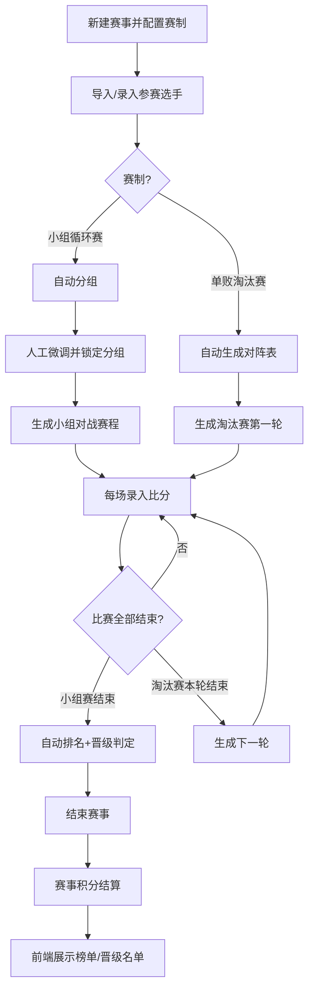
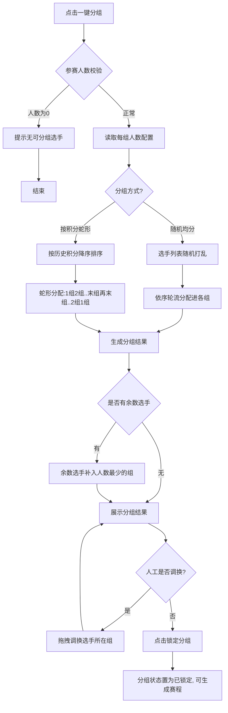
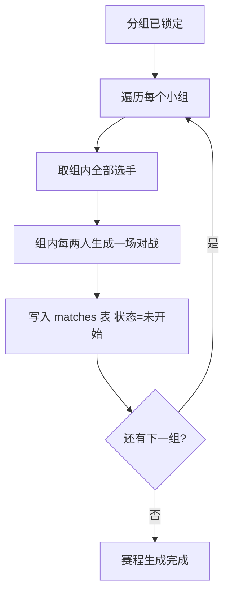
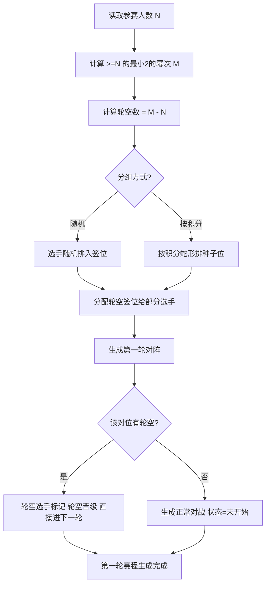
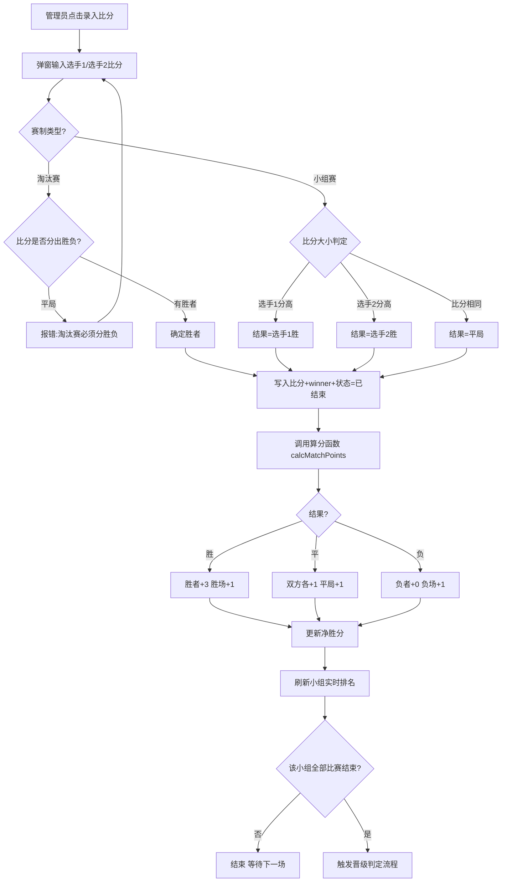
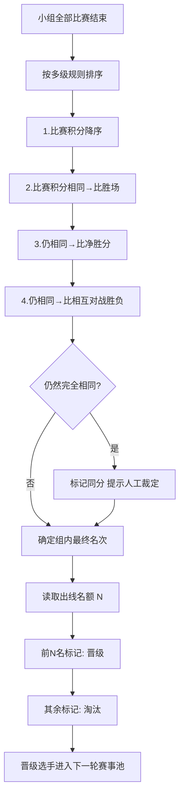
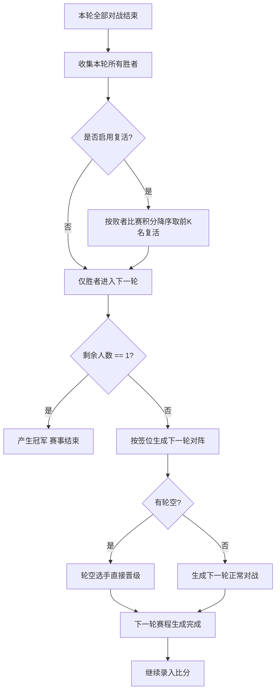
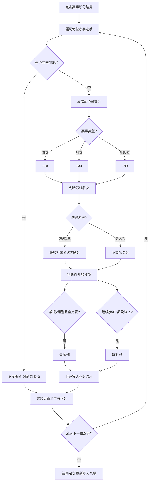

# 轻量级球馆赛事系统 — 关键交互流程图

> 本文件包含 Mermaid 源码，可在任何支持 Mermaid 的编辑器（VS Code、Typora、Obsidian、GitLab/GitHub）中直接渲染。
> 对应导出的图片见同目录 `out/` 下的 PNG / SVG 文件。

---

## 1. 整体主流程

---

## 2. 自动分组（小组循环赛）

---

## 3. 小组循环赛对战生成（两两对战）

---

## 4. 单败淘汰赛对阵生成（含轮空）

---

## 5. 录入比分（核心高频操作）

---

## 6. 小组赛晋级判定（含同分排序）

---

## 7. 淘汰赛逐轮推进（含复活）

---

## 8. 赛事积分结算（运营积分，独立于晋级）

