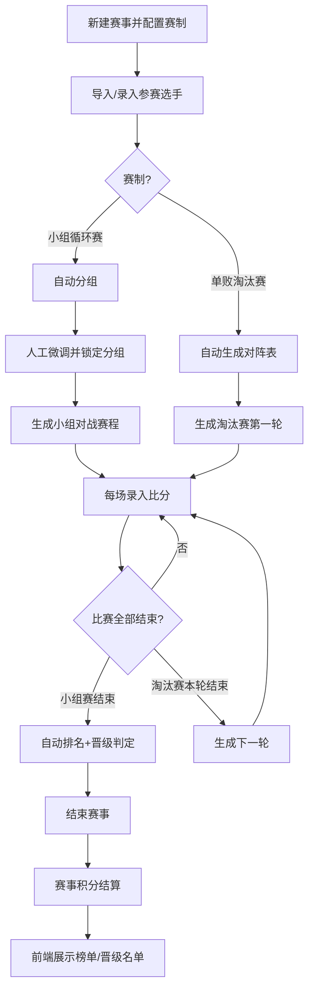
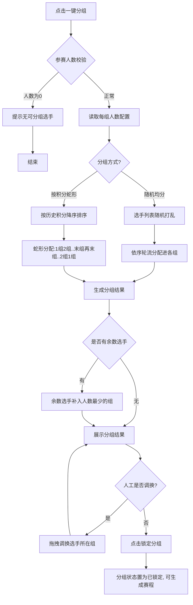
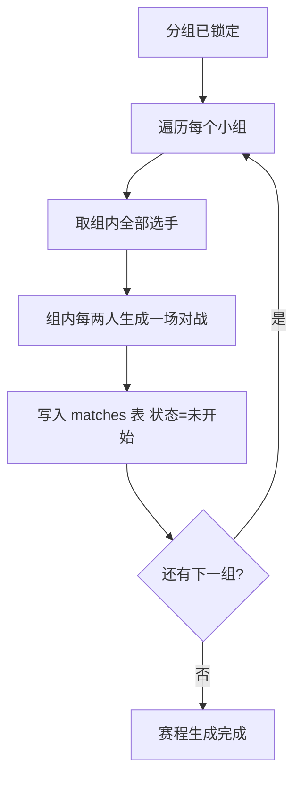
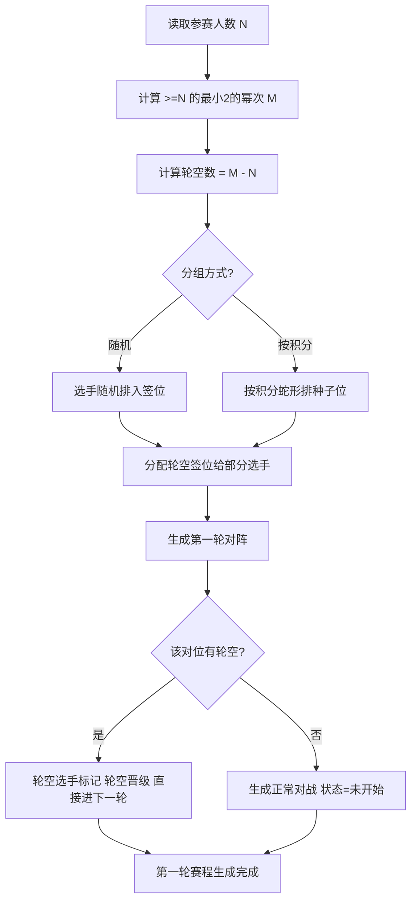
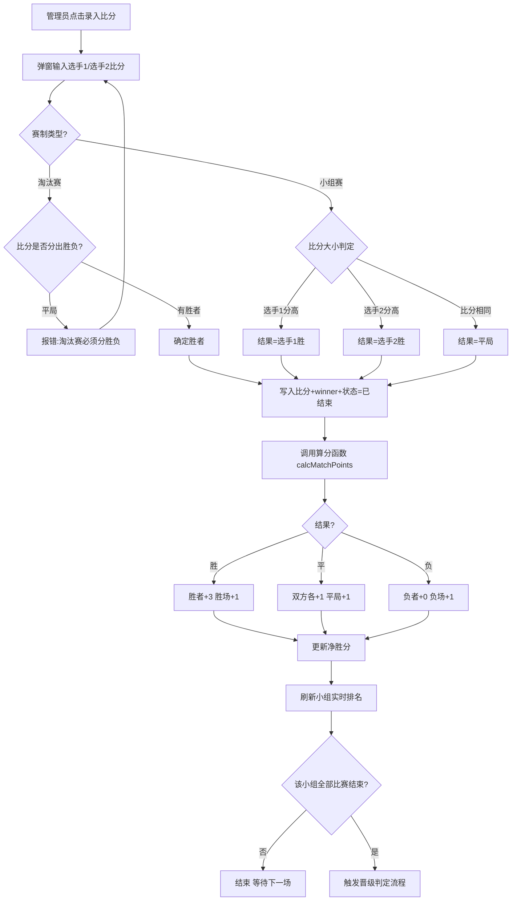
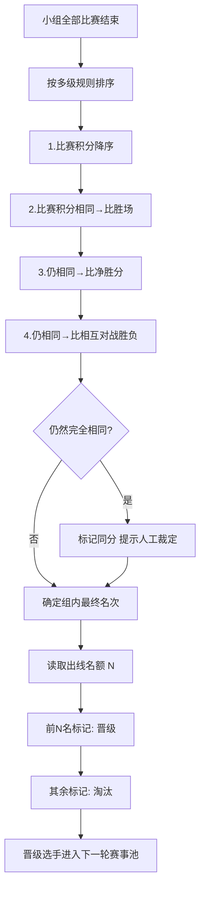
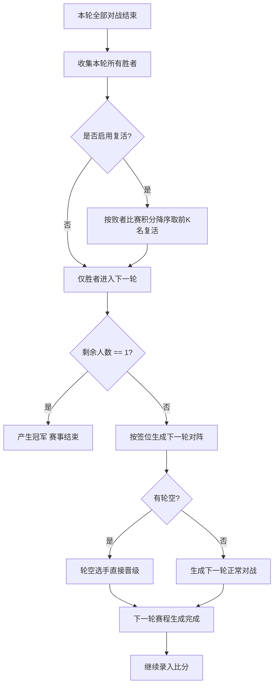
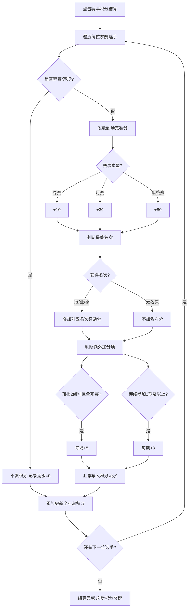

# 轻量级球馆赛事编排与积分管理系统 — 完整需求与设计文档

> 版本：v1.0　|　范围：第一阶段 MVP（小组循环赛 + 单败淘汰赛）
>
> 一句话定位：帮助球馆工作人员“10 分钟完成一场比赛编排”的轻量工具，核心链路为
> **导入选手 → 自动分组/排赛 → 录比分 → 自动排名/晋级 → 展示榜单**。

---

## 目录

1. [产品定位](#一产品定位)
2. [核心概念：两种积分](#二核心概念两种积分)
3. [六大功能模块](#三六大功能模块)
4. [开发计划（里程碑）](#四开发计划里程碑)
5. [数据库表结构](#五数据库表结构)
6. [接口清单（REST API）](#六接口清单rest-api)
7. [页面原型清单](#七页面原型清单)
8. [关键交互流程图](#八关键交互流程图)
9. [核心算法函数](#九核心算法函数)
10. [关键规则与风险](#十关键规则与风险)

---

## 一、产品定位

面向羽毛球/球馆赛事的轻量级赛事编排与积分管理系统。第一阶段只做两种主流赛制：

- **小组循环赛**（循环积分赛，最常用）
- **单败淘汰赛**

报名与保险继续使用第三方报名工具，系统只负责**导入报名结果**。

第一阶段**不做**：自研报名/二维码、保险、双败淘汰、瑞士轮、积分商城、在线支付、复杂权限。

---

## 二、核心概念：两种积分

文档最重要的设计前提——**把“比赛积分”和“赛事积分”彻底拆开**：

| 类型 | 作用 | 是否影响晋级 | 示例 |
|---|---|---|---|
| **比赛积分** | 用于小组赛排名与晋级判定 | 是 | 胜+3、平+1、负+0 |
| **赛事积分** | 运营货币，用于兑换球馆福利 | 否 | 周赛完赛+10、冠军+30 |

> 晋级靠比赛成绩，福利靠赛事积分。两套逻辑完全独立。

---

## 三、六大功能模块

### 1. 赛事管理
后台新建赛事并配置：名称、类型（周赛/月赛/年终赛）、赛制、报名人数上限、组别（业余/专业/少儿）、是否启用比赛积分、是否启用赛事积分、赛事规则说明。

### 2. 选手管理
- 手动单条录入：姓名、手机号、队伍、头像、组别、初始积分 50 分
- Excel 批量导入（模板下载、错误行提示）
- 统一管理：启用/禁用、编辑、删除
- **手机号作为唯一身份标识**（赛事积分需全年累计）

### 3. 自动分组
- 小组赛：每组人数 4/6/8、出线名额，支持「随机均分」与「按积分蛇形」两种方式，结果可视化 + 人工微调 + 锁定
- 淘汰赛：按人数自动生成对阵表，自动补 2 的幂次、生成轮空（轮空直接晋级）

### 4. 对战编排
- 小组赛：组内全员两两对战自动生成
- 淘汰赛：逐轮生成对阵
- 对战字段含状态（未开始/进行中/已结束）、比分、录分人；支持锁定/调换/补赛

### 5. 积分与晋级
- 比赛积分：录分后自动计算，胜+3/平+1/负+0（可后台配置）
- 小组排名：积分 → 胜场 → 净胜分 → 相互胜负
- 自动判定晋级/淘汰；淘汰赛胜者自动进下一轮，支持复活名额
- 赛事积分：到场分 + 名次分 + 加分项，按流水累计，全年不清零

### 6. 榜单展示（用户端）
赛事总榜、小组积分榜、赛程页、晋级名单、个人中心（积分/战绩/晋级状态）。

---

## 四、开发计划（里程碑）

> 按“先跑通一场比赛，再加运营功能”推进，每个里程碑可演示。

### M1：能管理一场赛事（数据基础）
建表、赛事 CRUD、选手手动录入、Excel 批量导入、选手启停、后台登录与权限。
**验收**：新建一场赛事并导入 50 名选手正确显示。

### M2：自动分组 + 自动排赛（核心引擎）
小组分组（随机/蛇形）+ 微调锁定、循环赛对战生成、淘汰赛对阵生成（轮空处理）、赛程锁定/调换/补赛。
**验收**：一键生成全部分组与对战，数据无重复、无遗漏。建议对该模块写自动化测试。

### M3：录比分 + 自动算分 + 自动晋级（业务闭环）
后台录分、比赛积分计算、小组多级排序、晋级判定、淘汰赛逐轮、人工修正。
**验收**：录完比分后排名与晋级自动正确，手动改分后排名实时更新。

### M4：前端展示 + 赛事积分 + 导出（运营功能）
小程序只读页面、赛事积分系统（到场/名次/加分/流水）、Excel 导出、多赛事并行。
**验收**：跑通 导入→分组→排赛→录分→排名→晋级→展示→积分→导出 全链路。

**依赖关系**：M1 → M2 → M3 → M4（逐层依赖上层数据结构）。

---

## 五、数据库表结构

> 最简 6 张核心表 + 1 张管理员表（MySQL）。

### 1. `admins` 管理员表
| 字段 | 类型 | 说明 |
|---|---|---|
| id | bigint PK | 主键 |
| username | varchar(50) | 登录名，唯一 |
| password_hash | varchar(255) | 密码哈希 |
| role | tinyint | 1=管理员 2=查看者 |
| status | tinyint | 1=启用 0=禁用 |
| created_at | datetime | 创建时间 |

### 2. `events` 赛事表
| 字段 | 类型 | 说明 |
|---|---|---|
| id | bigint PK | 主键 |
| name | varchar(100) | 赛事名称 |
| event_type | tinyint | 1=周赛 2=月赛 3=年终赛 |
| format | tinyint | 1=小组循环赛 2=单败淘汰赛 |
| max_players | int | 报名人数上限 |
| group_size | int | 每组人数 4/6/8（淘汰赛可空） |
| advance_count | int | 每组出线人数 |
| group_method | tinyint | 1=随机均分 2=按积分蛇形 |
| revive_count | int | 淘汰赛复活名额（第一阶段可为0） |
| enable_match_points | tinyint | 是否启用比赛积分 |
| enable_event_points | tinyint | 是否启用赛事积分 |
| match_win_point | int | 胜得分，默认3 |
| match_draw_point | int | 平得分，默认1 |
| match_lose_point | int | 负得分，默认0 |
| status | tinyint | 0=未开始 1=分组中 2=进行中 3=已结束 |
| rules_text | text | 赛事规则说明 |
| created_at | datetime | 创建时间 |

### 3. `players` 选手表（长期身份）
| 字段 | 类型 | 说明 |
|---|---|---|
| id | bigint PK | 主键 |
| name | varchar(50) | 姓名 |
| phone | varchar(20) | 手机号，唯一身份标识 |
| team | varchar(50) | 所属队伍 |
| avatar | varchar(255) | 头像 URL |
| total_event_points | int | 全年累计赛事积分 |
| status | tinyint | 1=启用 0=禁用 |
| created_at | datetime | 创建时间 |

### 4. `event_players` 赛事参赛表
| 字段 | 类型 | 说明 |
|---|---|---|
| id | bigint PK | 主键 |
| event_id | bigint FK | 关联赛事 |
| player_id | bigint FK | 关联选手 |
| category | tinyint | 组别 1=业余 2=专业 3=少儿 |
| group_id | bigint FK | 所属小组（淘汰赛可空） |
| init_score | int | 初始积分，默认50 |
| match_points | int | 本赛事比赛积分 |
| win_count | int | 胜场 |
| lose_count | int | 负场 |
| draw_count | int | 平局 |
| score_diff | int | 净胜分 |
| current_round | int | 当前轮次 |
| advance_status | tinyint | 0=待定 1=晋级 2=淘汰 3=轮空晋级 |
| rank_in_group | int | 小组内名次 |
| created_at | datetime | 创建时间 |

> 唯一索引：`(event_id, player_id)`，防止重复报名。

### 5. `groups` 小组表
| 字段 | 类型 | 说明 |
|---|---|---|
| id | bigint PK | 主键 |
| event_id | bigint FK | 关联赛事 |
| name | varchar(20) | 小组名，如 A组 |
| category | tinyint | 组别 |
| locked | tinyint | 分组是否锁定 |
| created_at | datetime | 创建时间 |

### 6. `matches` 对战表
| 字段 | 类型 | 说明 |
|---|---|---|
| id | bigint PK | 主键 |
| event_id | bigint FK | 关联赛事 |
| group_id | bigint FK | 小组（淘汰赛可空） |
| stage | tinyint | 1=小组赛 2=淘汰赛 |
| round | int | 轮次 |
| bracket_pos | int | 淘汰赛签位（小组赛可空） |
| player1_id | bigint FK | 选手1 |
| player2_id | bigint FK | 选手2（轮空时为空） |
| score1 | int | 选手1比分 |
| score2 | int | 选手2比分 |
| winner_id | bigint FK | 胜者（平局为空） |
| result | tinyint | 0=未判定 1=p1胜 2=p2胜 3=平局 |
| status | tinyint | 0=未开始 1=进行中 2=已结束 |
| recorder_id | bigint FK | 录分管理员 |
| recorded_at | datetime | 录分时间 |
| created_at | datetime | 创建时间 |

### 7. `points_logs` 赛事积分流水表
| 字段 | 类型 | 说明 |
|---|---|---|
| id | bigint PK | 主键 |
| player_id | bigint FK | 选手 |
| event_id | bigint FK | 关联赛事 |
| change_type | tinyint | 1=到场分 2=名次分 3=兼报加分 4=连续参赛 5=手动调整 |
| points | int | 变动值（可正负） |
| remark | varchar(255) | 备注 |
| operator_id | bigint FK | 操作人 |
| created_at | datetime | 时间 |

> 赛事积分只用流水累加，`players.total_event_points` 为流水汇总缓存，便于审计与纠错。

### 表关系总览
```
events 1───* event_players *───1 players
events 1───* groups 1───* event_players
events 1───* matches *───1 players (player1/player2/winner)
players 1───* points_logs *───1 events
```

---

## 六、接口清单（REST API）

> 统一前缀 `/api`，返回 `{ code, message, data }`。

### 认证与管理员
| 方法 | 路径 | 说明 |
|---|---|---|
| POST | `/auth/login` | 管理员登录 |
| POST | `/auth/logout` | 退出 |
| GET | `/auth/profile` | 当前登录信息 |

### 赛事管理
| 方法 | 路径 | 说明 |
|---|---|---|
| POST | `/events` | 新建赛事 |
| GET | `/events` | 赛事列表 |
| GET | `/events/{id}` | 赛事详情 |
| PUT | `/events/{id}` | 编辑赛事配置 |
| DELETE | `/events/{id}` | 删除赛事 |
| POST | `/events/{id}/start` | 开始比赛（触发分组+排赛） |
| POST | `/events/{id}/finish` | 结束赛事（触发赛事积分结算） |

### 选手管理
| 方法 | 路径 | 说明 |
|---|---|---|
| POST | `/players` | 手动新增选手 |
| GET | `/players` | 选手列表（搜索/分页） |
| PUT | `/players/{id}` | 编辑选手 |
| PUT | `/players/{id}/status` | 启用/禁用 |
| DELETE | `/players/{id}` | 删除 |
| GET | `/players/import-template` | 下载导入模板 |
| POST | `/players/import` | Excel 批量导入 |

### 赛事报名（赛事内选手）
| 方法 | 路径 | 说明 |
|---|---|---|
| POST | `/events/{id}/players` | 把选手加入赛事 |
| GET | `/events/{id}/players` | 赛事参赛名单 |
| POST | `/events/{id}/players/import` | 导入赛事参赛名单 |
| DELETE | `/events/{id}/players/{epId}` | 移除参赛选手 |

### 分组
| 方法 | 路径 | 说明 |
|---|---|---|
| POST | `/events/{id}/groups/generate` | 自动分组 |
| GET | `/events/{id}/groups` | 查看分组结果 |
| PUT | `/events/{id}/groups/move` | 手动调换选手分组 |
| POST | `/events/{id}/groups/lock` | 锁定分组 |

### 对战赛程
| 方法 | 路径 | 说明 |
|---|---|---|
| POST | `/events/{id}/matches/generate` | 自动生成对战表 |
| GET | `/events/{id}/matches` | 对战列表（按组/轮筛选） |
| PUT | `/matches/{id}` | 调换对战/补赛 |
| POST | `/matches/{id}/score` | 录入比分（触发算分+晋级判定） |
| POST | `/matches/{id}/lock` | 锁定赛程 |

### 积分与晋级
| 方法 | 路径 | 说明 |
|---|---|---|
| GET | `/events/{id}/standings` | 赛事总积分榜 |
| GET | `/events/{id}/groups/{gid}/standings` | 小组积分榜 |
| PUT | `/event-players/{epId}/points` | 手动修改比赛积分 |
| PUT | `/event-players/{epId}/advance` | 手动改晋级状态 |
| POST | `/events/{id}/advance/calc` | 触发晋级判定 |
| POST | `/events/{id}/knockout/next-round` | 生成淘汰赛下一轮 |

### 赛事积分（运营积分）
| 方法 | 路径 | 说明 |
|---|---|---|
| GET | `/players/{id}/points-logs` | 个人积分流水 |
| POST | `/events/{id}/event-points/settle` | 赛事积分结算（到场+名次） |
| POST | `/players/{id}/points/adjust` | 手动调整赛事积分 |
| GET | `/points/ranking` | 全年赛事积分总榜 |

### 导出
| 方法 | 路径 | 说明 |
|---|---|---|
| GET | `/events/{id}/export/players` | 导出参赛名单 |
| GET | `/events/{id}/export/matches` | 导出对战表 |
| GET | `/events/{id}/export/standings` | 导出积分榜 |

### 用户端（小程序，只读）
| 方法 | 路径 | 说明 |
|---|---|---|
| GET | `/public/events/{id}` | 赛事信息 |
| GET | `/public/events/{id}/standings` | 总榜单 |
| GET | `/public/events/{id}/groups` | 小组与小组榜 |
| GET | `/public/events/{id}/matches` | 赛程 |
| GET | `/public/events/{id}/advance` | 晋级名单 |
| GET | `/public/players/{id}/profile` | 个人战绩+积分 |

---

## 七、页面原型清单

### 后台管理端（Web）

- **登录页**：用户名、密码、登录。
- **工作台**：进行中赛事数、今日待录比分、选手总数、最近赛事；入口「新建赛事」。
- **赛事列表**：名称/类型/赛制/人数/状态/时间；筛选、搜索、查看/编辑/删除/复制。
- **新建/编辑赛事**：赛制切换动态显示配置项；积分开关与默认分值。
- **赛事详情（控制台）**：7 个 Tab + 全局按钮（一键分组/生成赛程/结束赛事/导出）。
  - **参赛选手**：列表 + 手动添加 + 批量导入（成功/失败统计）。
  - **分组管理**：分组卡片、一键分组、拖拽调换、锁定；淘汰赛显示对阵签位图。
  - **赛程对战**：按组/轮/状态筛选；行内「录入比分」弹窗；调换/补赛；淘汰赛「生成下一轮」。
  - **积分榜**：小组榜/总榜切换；自动多级排序；手动改分（需备注）。
  - **晋级管理**：按轮展示晋级/淘汰；自动判定 + 手动调整；复活名单。
  - **赛事积分**：到场分/名次分/加分项；结算按钮；手动调整；弃赛违规标记。
  - **设置**：编辑配置、删除赛事。
- **选手库（全局）**：跨赛事选手管理，含历史参赛与积分流水。
- **赛事积分总榜（全局）**：全年累计排名、流水查看、导出。

### 用户端（微信小程序，只读）
- 赛事首页、总积分榜、小组页、赛程页、晋级名单页、个人中心。

### 关键交互原则
1. 所有自动计算结果都可手动修正，且需备注原因写入日志。
2. 状态驱动按钮显隐，避免误操作。
3. 录比分高频，弹窗要快、提交即更新榜单。
4. 小程序端纯只读，写操作集中在后台。
5. 小组赛重「积分榜」，淘汰赛重「对阵树」。

---

## 八、关键交互流程图

### 1. 整体主流程


### 2. 自动分组（小组循环赛）


### 3. 小组循环赛对战生成


### 4. 单败淘汰赛对阵生成（含轮空）


### 5. 录入比分


### 6. 小组赛晋级判定（含同分排序）


### 7. 淘汰赛逐轮推进（含复活）


### 8. 赛事积分结算（运营积分，独立于晋级）


---

## 九、核心算法函数

这些是系统“大脑”，建议单独封装并写单元测试：

1. `generateGroups(eventId)` — 随机/蛇形分组
2. `generateRoundRobin(groupId)` — 小组两两循环对战
3. `generateBracket(eventId)` — 淘汰赛对阵表 + 轮空处理
4. `calcMatchPoints(matchId)` — 录分后算比赛积分
5. `sortGroupStandings(groupId)` — 多级排序（积分→胜场→净胜分→相互胜负）
6. `judgeAdvance(eventId)` — 小组出线判定
7. `nextKnockoutRound(eventId)` — 生成淘汰赛下一轮
8. `settleEventPoints(eventId)` — 赛事积分结算（到场+名次+加分项）

---

## 十、关键规则与风险

1. **分组与对阵算法是核心风险**：务必用边界数据测试（奇数人、非 2 幂次、单组不整除）。
2. **比赛积分 vs 赛事积分一定要拆开**，否则后期逻辑混乱（当前需求最容易踩的坑）。
3. **手机号做唯一身份**：赛事积分全年累计依赖稳定身份标识。
4. **所有自动计算都保留手动修正入口**：现场必有突发（弃赛、违规、补赛）。
5. **Excel 导入要做格式校验和错误行提示**，否则现场操作很痛苦。
6. **淘汰赛禁止平局**：录分弹窗强校验。

---

## 附：简易使用流程

1. 管理员新建赛事，配置赛制/组别/积分规则
2. 从第三方报名工具导出 Excel，后台导入选手
3. 系统一键自动分组（可微调后锁定）
4. 系统生成全部对战
5. 每场打完后台录入比分
6. 系统自动累计积分、排名、标记晋级/淘汰
7. 淘汰赛逐轮生成下一轮
8. 前端实时展示积分榜与晋级名单
9. 赛事结束后结算赛事积分，导出报表
